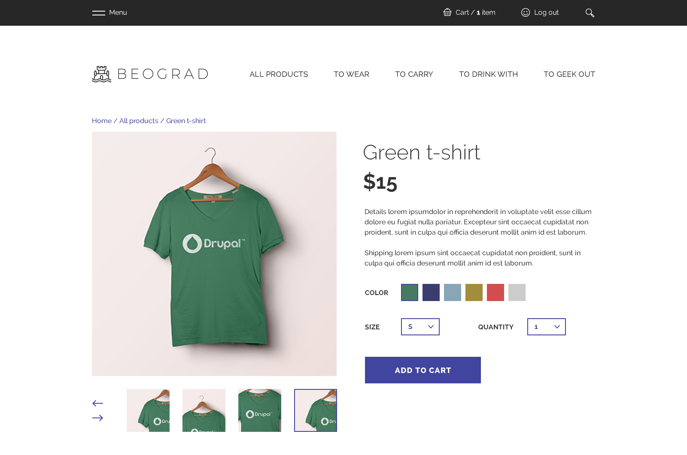

# Commerce 2.x demo project template

Based on [drupalcommerce/project-base](https://github.com/drupalcommerce/project-base), plus
a [custom theme](https://drupal.org/project/belgrade) and [demo content](https://drupal.org/project/commerce_demo).



## Setup

```
git clone git@github.com:gmoigneu/drupalcommerce-demo.git
cd drupalcommerce-demo
platform project:create
platform project:set <id>
git push platform master
```

Run this install or launch: `php scripts/quickstart`

boom.